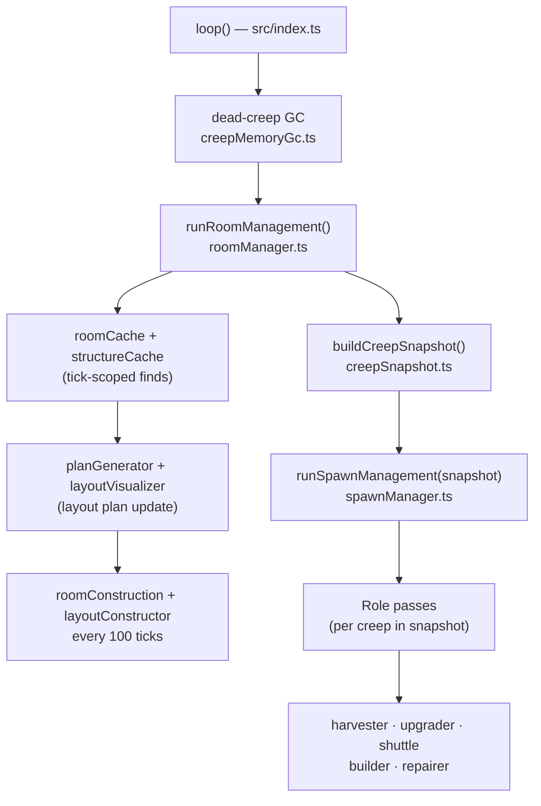

# screeps-ai-v03

Screeps World AI created with AI agent assistance.

## Project Goals

- Personal growth in using AI agents and the latest AI-assisted software development features.
- Personal growth in learning JavaScript and TypeScript through real implementation work.
- Personal growth in handling a larger multi-file codebase instead of small scripts.
- Gradually build an advanced Screeps World AI framework with a human-in-the-loop process for review and learning.

## Using Skills (Quick Start)

Project workflows live under [`.agents/skills/`](.agents/skills/) (each folder has a `SKILL.md`). Cursor discovers them for this workspace (**Settings → Rules → Skills**).

- Open **Agent** chat and type **`/`** to search and invoke a skill by name.
- Manual invocation (recommended for safety-critical work): **`/adding-a-creep-role`**, **`/checking-screeps-api`** — full slash list in [`docs/skills/README.md`](docs/skills/README.md)
- After a run you care to track, append an entry to the **Pilot Log** in [`docs/skills/README.md`](docs/skills/README.md).

Full **skill catalog**, **slash commands**, trigger phrases, and a short **practice routine**: [`docs/skills/README.md`](docs/skills/README.md).

## Architecture (creep roles)

### Tick pipeline

Each tick runs in this order:



- **Roles** (`src/roles/*.ts`): each creep role is a small **finite state machine** stored in `Memory.creeps[name]` (`state`, optional `targetId`, `stateSinceTick`). Transition rules and dispatch stay **inside the role file** for cohesion.
- **FSM helpers** (`src/roles/fsm.ts`): shared pure functions only (`isStoreEmpty`, `isStoreFull`, `transitionState`, `getObjectByIdOrNull`, `resolveSource`). No `Creep.prototype` extensions for trivial checks.
- **Energy acquisition** (`src/roles/energyAcquisition.ts`): shared `acquireEnergy` helper used by non-harvester roles — withdraws from source containers, picks up dropped energy, or harvests as fallback.
- **Types** (`src/types.d.ts`): extend `CreepMemory` / `RoomMemory` when adding states, persisted IDs, or room-level layout fields.

### Repo layout

```
src/
├── index.ts                    ← tick entry (loop export)
├── types.d.ts                  ← Memory interfaces
├── roles/                      ← one file per creep role
│   ├── fsm.ts                  ← shared FSM helpers
│   ├── energyAcquisition.ts    ← shared energy pickup logic
│   ├── harvester.ts            ← mines sources, deposits to spawn/extensions
│   ├── upgrader.ts             ← fills energy, upgrades controller
│   ├── shuttle.ts              ← energy courier (container → structures)
│   ├── builder.ts              ← builds construction sites
│   └── repairer.ts             ← repairs damaged structures
├── management/                 ← room / spawn coordination
│   ├── roomManager.ts          ← per-room orchestrator (calls sub-managers)
│   ├── spawnManager.ts         ← census-based spawn queue
│   ├── roomCache.ts            ← tick-scoped room.find cache
│   ├── structureCache.ts       ← tick-scoped structure cache
│   ├── roomConstruction.ts     ← legacy construction-site placement
│   ├── shuttleDemand.ts        ← shuttle population target calculation
│   ├── creepSnapshot.ts        ← pre-built creep-by-role/room index
│   ├── creepMemoryGc.ts        ← cleans Memory.creeps for dead creeps
│   ├── tickSignals.ts          ← cross-module tick-level derived signals
│   ├── repairConfig.ts         ← repair thresholds and priority rules
│   └── construction/           ← layout automation pipeline
│       ├── planGenerator.ts    ← generates RoomLayoutPlan in RoomMemory
│       ├── layoutConstructor.ts← places construction sites from plan
│       └── layoutVisualizer.ts ← renders plan overlays in-game
└── logging/                    ← logger + level plumbing
    ├── logger.ts               ← createLogger, Logger API
    ├── levels.ts               ← LogLevel enum, parseLogLevel
    └── resolveLevel.ts         ← getEffectiveLevel (Memory.log resolution)
dist/
└── main.js                     ← bundled output (git-ignored)
docs/
├── agent-references/           ← Screeps API + gameplay refs for agents
├── skills/                     ← skill catalog + pilot log
└── roadmaps/                   ← long-running implementation roadmaps
```

To add or evolve a role, use the project skill at `.agents/skills/adding-a-creep-role/SKILL.md` for the full cross-file checklist.

## Current capabilities

What the bot does today (update this section as features ship):

| Capability                         | Status | Notes                                                                                             |
| ---------------------------------- | ------ | ------------------------------------------------------------------------------------------------- |
| Harvest energy from sources        | ✓      | Harvester parks at source container when shuttles present; falls back to direct delivery          |
| Shuttle energy to spawn/extensions | ✓      | Demand-based population; withdraws from source containers, picks up dropped energy                |
| Upgrade room controller            | ✓      | Upgrader withdraws from controller-adjacent container                                             |
| Build construction sites           | ✓      | Builder count scales with site backlog (`ceil(sites/3)`)                                          |
| Repair damaged structures          | ✓      | Repairer count scales with repair backlog; priority-ordered by structure type                     |
| Autonomous construction placement  | ✓      | Layout plan (roads via PathFinder merge + future structures); sites every 100 ticks when approved |
| Layout visualization               | ✓      | Plan overlays rendered in-game for review/approval                                                |
| Road layout planning               | ✓      | Spawn→source (r1) and source→controller (r2) paths merge via shared CostMatrix accumulation       |
| Multi-room expansion               | ✗      | Planned — see `docs/roadmaps/room-layout-automation.md`                                           |
| Defense / towers                   | ✗      | Not yet implemented                                                                               |

## Logging

Logging lives in `src/logging/` (`createLogger`, levels, `Memory.log` resolution). Lines look like `[tick=…][moduleId][TAG] …`. Types for `Memory.log` are in `src/types.d.ts`.

**Levels** (strings in `Memory`): `error` → `information` → `verbose` → `debug`. Effective level: `Memory.log.modules[id]` → `Memory.log.default` → logger default. See [`AGENTS.md`](AGENTS.md) and [`src/logging/AGENTS.md`](src/logging/AGENTS.md) for logging rules; full **JSDoc** spec: [`docs/agent-references/jsdoc-conventions.md`](docs/agent-references/jsdoc-conventions.md).

**Console quick example:** `Memory.log = { default: "information" };` — more `Memory.log` recipes and the TypeScript logger API sketch: skill **`/managing-log-levels`** ([`.agents/skills/managing-log-levels/`](.agents/skills/managing-log-levels/)).

For behavior-change safety (ticks, intents, **action priority matrix**, return codes): **`/checking-screeps-api`** — curated notes in [`docs/agent-references/screeps-api.md`](docs/agent-references/screeps-api.md). For role-related logging expectations: **`/adding-a-creep-role`**.

## Scripts

- `npm run typecheck` — TypeScript (`tsc --noEmit`)
- `npm run watch` — `tsc --noEmit --watch` (typecheck while editing)
- `npm run lint` / `npm run lint:fix` — ESLint; `--fix` applies safe fixes
- `npm run format:check` / `npm run format` — Prettier check vs write
- `npm run fix` — `lint:fix` then `format` (one-shot cleanup)
- `npm run build` — `lint`, `format:check`, `typecheck`, then bundle to `dist/` via [`scripts/build.js`](scripts/build.js)
- `npm run upload` — upload `dist/` only (uses [`scripts/run-upload.js`](scripts/run-upload.js); reads repo-root `.env` if present). Env file values **override** the current shell for keys you set in the file, so you can run `upload` then `upload:ptr` in the same session without stale `SCREEPS_*` leaking between targets. Credentials: [`.env.example`](.env.example).
- `npm run upload:ptr` — same, but uses `.env.ptr` when that file exists (`upload` with a different env filename).
- `npm run upload -- .env.<profile>` — generic: after `--`, pass another env file path (e.g. `npm run upload -- .env.community`). Duplicate the `SCREEPS_*` lines you need in each profile; keys missing from a profile file still come from the shell.
- `npm run deploy` — `build` then `upload`
- `npm run deploy:ptr` — `build` then `upload:ptr`

For official PTR, set `SCREEPS_HOST=screeps.com/ptr` (path prefix; not `SCREEPS_BRANCH=ptr` on bare `screeps.com`, which targets the live server). See [`.env.example`](.env.example).

Full verify/build/CI workflow: skill **`/building-and-deploying-screeps`** ([`.agents/skills/building-and-deploying-screeps/`](.agents/skills/building-and-deploying-screeps/)).

## CI and deploy

GitHub Actions builds (`npm run build`) then uploads `dist/main.js` via [`scripts/upload-screeps.js`](scripts/upload-screeps.js).

| Git branch | Workflow                     | Target                                                                                                                                                                                                                                                                                                                                                                                                                                                        |
| ---------- | ---------------------------- | ------------------------------------------------------------------------------------------------------------------------------------------------------------------------------------------------------------------------------------------------------------------------------------------------------------------------------------------------------------------------------------------------------------------------------------------------------------- |
| `main`     | `.github/workflows/main.yml` | Official server: host `screeps.com`, in-game code branch `main`. Uses secret `SCREEPS_TOKEN`.                                                                                                                                                                                                                                                                                                                                                                 |
| `test`     | `.github/workflows/test.yml` | Community server: variable **`SCREEPS_TEST_HOST`** (hostname only, no scheme). Optional variables **`SCREEPS_TEST_PROTOCOL`** (often `http`) and **`SCREEPS_TEST_PORT`** (omit for port 80 with `http`; use `21025` if the API is on that port). Auth: secret **`SCREEPS_TEST_TOKEN`**, or secrets **`SCREEPS_TEST_USERNAME`** + **`SCREEPS_TEST_PASSWORD`**. Optional **`SCREEPS_TEST_BRANCH`** for the **Screeps editor** code branch (defaults to `test`). |

`SCREEPS_BRANCH` in CI is the branch tab in the Screeps code editor on that server, not the git branch name. Official releases: push or merge to `main`. Try changes on the community server by pushing to `test`. Upload script env: **`SCREEPS_PROTOCOL`** / **`SCREEPS_PORT`** (see [`.env.example`](.env.example)).

**Credentials and git:** never commit passwords, tokens, or `.env`. Use [GitHub Actions secrets](https://docs.github.com/en/actions/security-guides/using-secrets-in-github-actions) for CI. Locally, `npm run upload` loads a repo-root `.env` **only if that file exists** (via [`scripts/run-upload.js`](scripts/run-upload.js)); CI has no `.env` and uses the workflow `env` block. For values not set in the file, the shell environment still applies unless you add them to each profile file.
