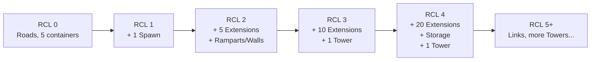
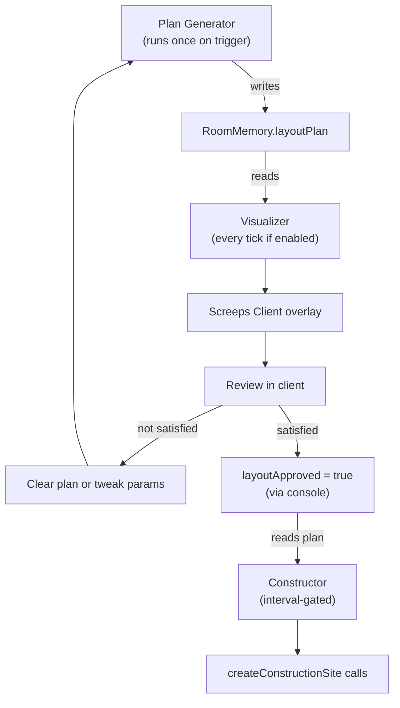
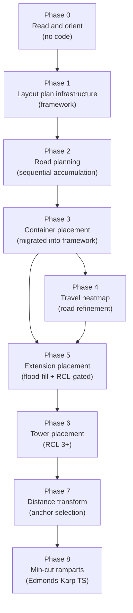

# Room Layout Automation — Learning Roadmap

**Purpose:** Phased, teach-as-you-go roadmap for automating room construction (roads, extensions, towers, defense) from RCL progression and travel patterns. Each phase is a standalone milestone you can implement across sessions.

**Maintenance:** Tick checkboxes as you complete phases. Point the agent at this file to resume work (`@docs/roadmaps/room-layout-automation.md` or "continue the room layout roadmap").

## Progress

- [x] **Phase 0** — Read and orient (no code)
- [x] **Phase 1** — Layout plan infrastructure (Plan / Store / Visualize / Iterate / Approve / Construct)
- [ ] **Phase 2** — Road planning (first consumer of the framework, sequential path accumulation)
- [ ] **Phase 3** — Container placement (source containers + controller buffer container, migrated into framework)
- [ ] **Phase 4** — Travel heatmap (road refinement from actual creep movement)
- [ ] **Phase 5** — Extension placement (flood-fill + RCL-gated)
- [ ] **Phase 6** — Tower placement (RCL 3+)
- [ ] **Phase 7** — Distance transform (advanced, anchor selection)
- [ ] **Phase 8** — Min-cut ramparts (advanced)

---

## How to Think About the Problem

There are two orthogonal concerns. Keeping them separate in your mind (and in code) is the key:

1. **WHAT to build and WHEN** — controlled by Room Controller Level (RCL). The game enforces hard limits on how many extensions, towers, etc. you can place per level. This is a lookup table problem.

2. **WHERE to build it** — a spatial planning problem. Roads go where creeps actually walk. Extensions go somewhere open near the spawn. Towers go where they cover your base. This ranges from "hardcoded relative to spawn" (easy) to "distance transform + stamps" (advanced).

The community has settled on two broad philosophies for WHERE:

- **Prescriptive (stamps/bunkers)**: design the layout offline once, store it as a data structure, place pieces as RCL unlocks them. Predictable, cheap at runtime, less adaptive.
- **Reactive (heatmap)**: observe where creeps actually walk each tick, accumulate a heat signal, build roads on hotspots. Adaptive, but requires careful memory budgeting.

**Recommended approach for learning**: start prescriptive for everything except roads (roads benefit greatly from reactive heatmap), then layer in the heatmap once the prescriptive system is solid.

---

## The Existing Scaffold (know this before touching anything)

Key file: [`src/management/roomConstruction.ts`](../../src/management/roomConstruction.ts)

- Already runs every `CONSTRUCTION_PLAN_INTERVAL = 100` ticks
- Already guards on `Game.cpu.bucket < 1200`
- Already places containers with `PathFinder.search`

Key file: [`src/management/roomManager.ts`](../../src/management/roomManager.ts) — calls `runRoomConstruction`

Key file: [`src/types.d.ts`](../../src/types.d.ts) — `RoomMemory` is where we add layout state fields

This scaffold is your home base. Every phase in this roadmap adds to `roomConstruction.ts` or an extracted sibling file, never duplicating the interval/bucket logic.

---

## Mental Model: RCL Progression as a State Machine



`room.controller?.level` gives you the current level. The game's `CONTROLLER_STRUCTURES` constant (built into the Screeps API) gives you the allowed count per structure type per level — you do not need to hardcode the table yourself.

**Key API fact (from [Control](http://docs.screeps.com/control.html)):** roads are available from RCL 0; extensions start at RCL 2; first tower at RCL 3.

---

## Phase 0 — Read and Orient (no code yet)

**Goal**: understand what you are working with before writing a line.

- Read [`src/management/roomConstruction.ts`](../../src/management/roomConstruction.ts) top to bottom
- Read the [official RCL table](http://docs.screeps.com/control.html) — note `CONTROLLER_STRUCTURES` is available in-game too
- Run `console.log(JSON.stringify(CONTROLLER_STRUCTURES))` in the Screeps console to see the full structure limit table at runtime
- Read [`docs/agent-references/screeps-api.md`](../agent-references/screeps-api.md) — `PathFinder.search` return shape, CPU bucket rules

**You will learn**: the existing CPU guard pattern, how `PathFinder.search` returns `{ path: RoomPosition[], incomplete: boolean }`, and why we run construction planning on an interval not every tick.

---

## Phase 1 — Layout Plan Infrastructure

**Goal**: build the reusable Plan / Store / Visualize / Iterate / Approve / Construct framework that all future layout phases will plug into.

### Architecture



The iteration cycle is: **Plan → Store → Visualize → Review → (not happy?) → clear plan / adjust → re-Plan**. Only when you break out of that loop does construction happen.

### Memory Shape

```typescript
// New types in src/types.d.ts:

interface RoadSegmentPlan {
  label: string; // e.g. "spawn→source-5bbcaf" or "source-5bbcaf→ctrl"
  path: [number, number][]; // [[x,y], [x,y], ...] — compact, ~2 bytes per tile
  rcl: number; // which RCL this road belongs to (0 = any)
}

interface StructurePlacementPlan {
  type: BuildableStructureConstant;
  pos: [number, number]; // [x, y]
  rcl: number; // e.g. 2 for first extensions, 3 for first tower
}

interface RoomLayoutPlan {
  generatedAtTick: number;
  roads: RoadSegmentPlan[];
  structures: StructurePlacementPlan[]; // extensions, towers, etc. (future phases)
}

// Added to RoomMemory:
interface RoomMemory {
  // ...existing fields...
  layoutPlan?: RoomLayoutPlan;
  layoutVisualize?: boolean; // true = draw the plan overlay each tick
  layoutVisualizeRcl?: number; // 0 or undefined = show all layers; N = show only RCL N items
  layoutApproved?: boolean; // true = construct from the stored plan
}
```

**Memory cost**: a road path of 20 tiles is `[[x,y],...] = ~120 characters` serialized. Four road segments = ~500 chars total. Dramatically smaller than a serialized CostMatrix (2500 numbers = 10KB+).

### Three Modules

Split under `src/management/construction/` per the management `AGENTS.md` guidance:

| Module                     | Runs when                                                          | Does                                                                                       |
| -------------------------- | ------------------------------------------------------------------ | ------------------------------------------------------------------------------------------ |
| **`planGenerator.ts`**     | Once on trigger (no plan exists, or plan was cleared)              | Computes layout items, writes `room.memory.layoutPlan`                                     |
| **`layoutVisualizer.ts`**  | Every tick (if `layoutVisualize === true`)                         | Reads stored plan, draws with `RoomVisual` — no computation, just iteration over positions |
| **`layoutConstructor.ts`** | On `CONSTRUCTION_PLAN_INTERVAL`, only if `layoutApproved === true` | Reads stored plan, calls `createConstructionSite` for items matching current RCL           |

Existing `roomConstruction.ts` keeps container logic unchanged. `roomManager.ts` orchestrates: calls plan generator (trigger check), visualizer (every tick), constructor (on interval + approved).

### Controls (Screeps console)

```javascript
// Toggle visualization
Memory.rooms["W1N1"].layoutVisualize = true; // turn on overlay
Memory.rooms["W1N1"].layoutVisualize = false; // turn off overlay

// Filter by RCL layer
Memory.rooms["W1N1"].layoutVisualizeRcl = 3; // show only RCL 3 items
Memory.rooms["W1N1"].layoutVisualizeRcl = 0; // show all layers
delete Memory.rooms["W1N1"].layoutVisualizeRcl; // same as 0

// Re-trigger plan generation (iterate)
delete Memory.rooms["W1N1"].layoutPlan; // clears plan; generator runs next tick

// Approve for construction
Memory.rooms["W1N1"].layoutApproved = true; // constructor starts placing sites
```

### Visualizer Behavior

- Reads `room.memory.layoutPlan` — if missing, does nothing
- Guards on `room.memory.layoutVisualize === true` — if false/undefined, does nothing
- Filters items by `room.memory.layoutVisualizeRcl` (0/undefined = show all)
- Draws road paths as circles + dotted polylines; different colors per segment type
- Draws structure plans as labeled markers (shape/color by structure type)
- Zero game-state side effects, negligible CPU

### Constructor Behavior

- Runs on `CONSTRUCTION_PLAN_INTERVAL` cadence (not every tick)
- Guards on `room.memory.layoutApproved === true`
- Guards on CPU bucket (same `MIN_BUCKET_FOR_CONSTRUCTION_PLAN` pattern)
- For each planned item at or below the current RCL: check if road/structure already exists or has a pending site; if not, call `createConstructionSite`
- Places all eligible sites at once (not one at a time) — the spawn manager already scales builders via `Math.ceil(myConstructionSiteCount / 3)`
- Watch the **100 construction site cap** per player; multi-room budgeting is a future concern

### What you will learn

- Separating expensive computation (plan) from cheap rendering (visualize)
- TypeScript interface design for serializable plan data
- `RoomVisual` as a zero-side-effect debugging tool
- The "human-in-the-loop iteration" pattern for game AI development

### Files touched

- [`src/types.d.ts`](../../src/types.d.ts) — new plan/control interfaces on `RoomMemory`
- `src/management/construction/planGenerator.ts` (new)
- `src/management/construction/layoutVisualizer.ts` (new)
- `src/management/construction/layoutConstructor.ts` (new)
- [`src/management/roomManager.ts`](../../src/management/roomManager.ts) — orchestration calls

### Human checkpoint

Phase 1 ships the framework without real PathFinder-driven layout yet (Phase 2 adds roads). Validate end-to-end behavior **before** Phase 2 by injecting a dummy plan from the Screeps console, then exercising visualize / approve / construct:

```javascript
// Replace W1N1 with your room name
Memory.rooms["W1N1"].layoutPlan = {
  generatedAtTick: Game.time,
  roads: [
    {
      label: "test-road",
      path: [
        [25, 25],
        [26, 25],
        [27, 25],
        [28, 25],
        [29, 25],
      ],
      rcl: 0,
    },
  ],
  structures: [{ type: STRUCTURE_EXTENSION, pos: [24, 24], rcl: 2 }],
};
Memory.rooms["W1N1"].layoutVisualize = true;
```

Verify:

1. With visualization on, roads and structure markers render as intended.
2. `layoutVisualizeRcl` filtering behaves as specified (e.g. show/hide RCL-tagged structures vs roads depending on layer).
3. `delete Memory.rooms["W1N1"].layoutPlan` clears the overlay on the next relevant tick (generator may recreate — behavior depends on trigger logic).
4. `Memory.rooms["W1N1"].layoutApproved = true` lets the constructor place construction sites for eligible plan items (respect terrain / occupancy checks).
5. RCL gating: planned structures above current controller level must **not** get sites until RCL catches up (e.g. extension at `rcl: 2` in an RCL 1 room).
6. Cadence + bucket: constructor runs only on `CONSTRUCTION_PLAN_INTERVAL`, not every tick, and defers when bucket is below `MIN_BUCKET_FOR_CONSTRUCTION_PLAN`.

### External dependencies

Phase 1 does **not** require copying community algorithms or visualization helpers into the repo:

- **[Screeps-Tutorials/basePlanningAlgorithms](https://github.com/Screeps-Tutorials/Screeps-Tutorials/tree/Master/basePlanningAlgorithms)** — `distanceTransform`, `floodFill`, and `mincut` solve open-space scoring, seed proximity (BFS), and chokepoint cuts. None apply to Phase 1 infrastructure; the roadmap maps them to later phases (`floodFill` → Phase 5 extensions, `distanceTransform` → Phase 7 anchors, `mincut` → Phase 8 ramparts).
- **[screepers/RoomVisual](https://github.com/screepers/RoomVisual)** — native `RoomVisual` (`circle`, `poly`, `rect`, `text`) is enough for overlays here. Consider borrowing `.structure()`-style rendering later (e.g. Phase 5+) when many structure types need recognizable glyphs.

**Container placement vs algorithms:** [`src/management/roomConstruction.ts`](../../src/management/roomConstruction.ts) already uses path-aware choices (`PathFinder` along controller ↔ source routes). Replacing that with flood fill or distance transform would not improve correctness or CPU for containers; flood fill ignores terrain costs, and distance transform optimizes “open space,” not “on the haul path.” Phase 3 can align containers with planned roads without swapping algorithms.

---

## Phase 2 — Road Planning (First Consumer of the Framework)

**Goal**: implement the plan generator logic for roads — spawn→source and source→controller paths — using sequential accumulation so paths merge naturally.

### Paths to plan

1. **Spawn → each source** (range 1 from source) — the shuttle/builder highway
2. **Each source → controller** (range 2 from controller) — the upgrader supply route

A direct spawn→controller road is intentionally excluded: upgraders get energy from source containers (or the controller buffer container), so useful traffic flows through sources.

**Controller-side road terminus**: the road stops at `range: 2` (tighter ring around the upgrader / controller-buffer area), not on the controller tile. Can be refined later to target the buffer container position directly via `room.memory.controllerContainerId`. (`roomConstruction` buffer container placement still uses `CONTROLLER_BUFFER_CONTAINER_RANGE`.)

### Sequential Path Accumulation (critical for road merging)

Paths are computed **one at a time in priority order**. After each path is computed, its tiles are marked as cost 1 in a shared CostMatrix. This way subsequent paths prefer to merge onto already-planned tiles instead of running parallel.

```typescript
const plannedRoadsCM = new PathFinder.CostMatrix();

// Seed with existing built roads
room.find(FIND_STRUCTURES).forEach((s) => {
  if (s.structureType === STRUCTURE_ROAD)
    plannedRoadsCM.set(s.pos.x, s.pos.y, 1);
});

const opts: PathFinderOpts = {
  maxOps: PATHFINDER_MAX_OPS,
  maxRooms: 1,
  plainCost: 2,
  swampCost: 10,
  roomCallback() {
    return plannedRoadsCM;
  },
};

// Compute in priority order; each path accumulates into the CM
for (const { origin, goal, label } of orderedGoals) {
  const result = PathFinder.search(origin, goal, opts);
  if (!result.incomplete) {
    // Accumulate: next path will prefer to merge onto these tiles
    for (const pos of result.path) {
      plannedRoadsCM.set(pos.x, pos.y, 1);
    }
    plan.roads.push({
      label,
      path: result.path.map((p) => [p.x, p.y]),
      rcl: 0,
    });
  }
}
```

### Path ordering (determines which route is the trunk)

1. **Spawn → closest source** — highest traffic (shuttles run constantly)
2. **Spawn → second source** — merges near spawn, branches toward its source
3. **Closest source → controller** — merges with path 1 near source, branches toward controller zone
4. **Second source → controller** — merges with path 2 or 3 where beneficial

This produces a **tree-like road network**: shared trunk near spawn branching outward toward destinations — exactly how real infrastructure works.

### Why ordering matters

Without ordering, all paths are computed against the same initial CostMatrix (only built roads at cost 1). If spawn→source1 and spawn→source2 start from the same spawn but target nearby-but-different positions, they compute independent routes and run parallel. With ordering, path 2 sees path 1's tiles at cost 1 and merges onto them wherever the detour cost is acceptable.

### Place all sites at once (Phase 1 constructor behavior)

A partially-built road path has fatigue gaps at unbuilt tiles, so finishing the whole path fast matters. The spawn manager already scales builders via `desiredBuilders = Math.ceil(myConstructionSiteCount / 3)`. The only limit is the **100 construction site cap** per player — road paths are typically 15–25 tiles each, well within budget for a single room.

### What you will learn

- Sequential planning with CostMatrix accumulation
- How `plainCost: 2` + existing roads at cost 1 makes the pathfinder prefer shared tiles
- Path priority ordering as an implicit layout strategy
- Writing plan data to the `RoomLayoutPlan.roads` schema from Phase 1

### Files touched

- `src/management/construction/planGenerator.ts` — road planning logic added here

### Human checkpoint

1. Set `Memory.rooms['<name>'].layoutVisualize = true` in the Screeps console
2. Verify in the client:
   - Paths merge near spawn (shared trunk, not parallel routes)
   - Spawn→source paths reach the source adjacency
   - Source→controller paths end ~2 tiles from controller
   - No weird zigzags through walls
3. If not satisfied: `delete Memory.rooms['<name>'].layoutPlan` → adjust parameters → re-check
4. When happy: `Memory.rooms['<name>'].layoutApproved = true` → watch builders construct

---

## Phase 3 — Container Placement (Migrated into Framework)

**Goal**: migrate the existing source container and controller buffer container logic from [`src/management/roomConstruction.ts`](../../src/management/roomConstruction.ts) into the layout plan framework so containers are planned, visualized, iterated, and approved alongside roads.

**Why here**: containers are the next most important infrastructure after roads. Source containers define where harvesters drop energy (and where road endpoints converge). The controller buffer container defines where upgraders work. Seeing containers alongside roads in the visualizer lets you verify the whole energy flow layout before anything gets built.

### What gets planned

1. **Source containers** — one per source, adjacent (range 1). Current logic in `planContainerNearSource` picks the tile along the PathFinder path from controller to source. The plan generator reuses this logic but writes to `layoutPlan.structures` instead of calling `createConstructionSite` directly.

2. **Controller buffer container** — one per room, ~3 steps from controller toward the nearest source (see `CONTROLLER_BUFFER_CONTAINER_RANGE`). Current logic in `planContainerNearController` uses `PathFinder.search` and picks `path[CONTROLLER_BUFFER_CONTAINER_RANGE - 1]`.

Both get `rcl: 0` (containers are available at any RCL, capped at 5 per room).

### Integration with road planning

Container positions should be planned **after** roads (Phase 2) so the visualizer shows them together. The road planning CostMatrix accumulation can also inform container placement — e.g., source containers should sit on or adjacent to the road endpoint near each source.

### Migration path

- Move the position-selection logic from `planContainerNearSource` and `planContainerNearController` into `planGenerator.ts` (writing `StructurePlacementPlan` entries with `type: STRUCTURE_CONTAINER`)
- Keep the existing functions in `roomConstruction.ts` as a fallback until the framework is proven, then remove them
- The `layoutConstructor` already knows how to place `StructurePlacementPlan` items via `createConstructionSite`

### Visualizer appearance

Containers could be drawn as a small square marker (distinct from road circles):

```typescript
room.visual.rect(x - 0.3, y - 0.3, 0.6, 0.6, {
  fill: "#44ff44", // green for containers
  opacity: 0.7,
  stroke: "#228822",
});
```

### What you will learn

- Migrating existing logic into a new framework without breaking the live system
- How container positions relate to road endpoints and source/controller positions
- The 5-container-per-room cap as a planning constraint

### Files touched

- `src/management/construction/planGenerator.ts` — container planning logic added
- `src/management/construction/layoutVisualizer.ts` — container rendering
- [`src/management/roomConstruction.ts`](../../src/management/roomConstruction.ts) — existing container logic kept as fallback initially, then removed

### Human checkpoint

1. With `layoutVisualize = true`, verify containers appear at sensible positions:
   - One green marker adjacent to each source (on or near the road endpoint)
   - One green marker ~3 tiles from controller along the source path
2. If positions look wrong: `delete Memory.rooms['<name>'].layoutPlan` → tweak → re-check
3. When happy: approve and watch builders place both roads and containers

---

## Phase 4 — Travel Heatmap for Road Refinement

**Goal**: track where creeps actually walk each tick; accumulate a heat signal; add roads on well-traveled tiles that do not yet have them.

**Why after Phase 3**: Phase 2 gives you planned roads on the "correct" paths and Phase 3 places the containers they connect. The heatmap fills in gaps where creeps deviate (e.g., walking around containers, detouring around construction sites).

**Core concept — serialized CostMatrix as heatmap:**

```typescript
// In RoomMemory (types.d.ts addition):
heatmap?: number[]; // PathFinder.CostMatrix.serialize() result

// Each tick (sampled, e.g., every 10 ticks):
const cm = heatmapFromMemory(room);
for (const creep of creepsInRoom) {
  cm.set(creep.pos.x, creep.pos.y, Math.min(255, cm.get(creep.pos.x, creep.pos.y) + 1));
}
saveHeatmapToMemory(room, cm);

// In plan generator: find tiles above threshold, no existing road → add to layoutPlan.roads
```

**Memory budget warning**: a serialized CostMatrix is ~2500 numbers (50x50). That is roughly 10-15 KB per room. One mitigation: only store the top-N hotspot positions instead of the full matrix.

**What you will learn**: `CostMatrix.serialize`/`deserialize`, memory size trade-offs, sampling strategies, tick-based accumulation.

**Human checkpoint before merge**: measure Memory size before and after; decide full matrix vs. hotspot list.

---

## Phase 5 — Extension Placement (RCL-Gated, Positional)

**Goal**: when RCL ticks up and new extensions are allowed, add them to the layout plan in a predictable pattern near the spawn.

**Core concept — count existing + allowed, fill the gap:**

```typescript
const allowed =
  CONTROLLER_STRUCTURES[STRUCTURE_EXTENSION][room.controller.level];
const existing = room.find(FIND_MY_STRUCTURES, {
  filter: { structureType: STRUCTURE_EXTENSION },
}).length;
const sites = room.find(FIND_MY_CONSTRUCTION_SITES, {
  filter: { structureType: STRUCTURE_EXTENSION },
}).length;
const needed = allowed - existing - sites;
// add `needed` positions to layoutPlan.structures with appropriate rcl tags
```

**Placement strategy — flood fill from spawn (preferred over spiral):**

The [Screeps-Tutorials `floodFill.js`](https://github.com/Screeps-Tutorials/Screeps-Tutorials/blob/Master/basePlanningAlgorithms/floodFill.js) provides a BFS from seed positions (e.g., your spawn) that scores every open tile by proximity, skipping terrain walls. Pick the `needed` lowest-value tiles not already occupied.

Each extension gets an `rcl` tag matching the RCL at which it becomes available (2, 3, 4, ...). The visualizer shows them per-layer; the constructor only places sites for structures at or below the current RCL.

**What you will learn**: BFS over a `CostMatrix`, `CONTROLLER_STRUCTURES` lookup, RCL-tagged plan items.

---

## Phase 6 — Tower Placement (RCL 3+, Coverage-Aware)

**Goal**: add towers to the layout plan in positions that maximize hit coverage.

**Core concept**: towers deal damage based on distance (`TOWER_FALLOFF`, range 5-20 tiles). Simple placement: find an open tile within 5-8 tiles of spawn not already planned for another structure.

**Advanced approach** (later): compute a coverage score for each candidate tile by summing expected damage over wall/border tiles.

Each tower gets `rcl: 3` (first tower), `rcl: 5` (second), etc. matching the official unlock schedule.

---

## Phase 7 — Distance Transform for Open-Space Finding (Advanced)

**Goal**: use the Distance Transform algorithm to score every tile by distance from nearest wall/obstacle, then pick the highest-scoring open cluster as your layout anchor.

**Two variants from [Screeps-Tutorials `distanceTransform.js`](https://github.com/Screeps-Tutorials/Screeps-Tutorials/blob/Master/basePlanningAlgorithms/distanceTransform.js):**

- `distanceTransform` (Chebyshev / 8-directional): finds open **square** areas
- `diagonalDistanceTransform` (Manhattan / 4-directional): finds open **diamond** areas

Both have `enableVisuals: boolean` built in for debugging.

**CPU note**: run once on room claim, cache anchor position in `RoomMemory`.

---

## Phase 8 — Minimum Cut Wall/Rampart Placement (Advanced)

**Goal**: automatically find optimal rampart positions that cut your base off from room exits at terrain chokepoints.

**Reference**: [Screeps-Tutorials `mincut.ts`](https://github.com/Screeps-Tutorials/Screeps-Tutorials/blob/Master/basePlanningAlgorithms/mincut.ts) — full TypeScript Edmonds-Karp implementation.

```typescript
minCutToExit(sources: Point[], costMap: CostMatrix): Point[];
// sources = base interior tiles; costMap = terrain weights; returns = rampart positions
```

Rampart positions get added to `layoutPlan.structures` with appropriate `rcl` tags. The visualize/iterate/approve loop applies here too.

**CPU note**: expensive. Run once on room claim or defense replant. Store result in `layoutPlan`.

---

## Recommended Start Order



Phase 5 only requires Phase 3 as prerequisite (roads + containers define the energy flow before extensions). Phase 4 (heatmap) can run in parallel or after Phase 5. Phases 7 and 8 are independent of 4-6 and can be tackled whenever you want to level up.

---

## Key References

- [`docs/agent-references/screeps-api.md`](../agent-references/screeps-api.md) — PathFinder.search, CPU bucket, action timing
- [`src/management/roomConstruction.ts`](../../src/management/roomConstruction.ts) — existing container scaffold
- [`src/types.d.ts`](../../src/types.d.ts) — where new `RoomMemory` fields go
- [`src/management/AGENTS.md`](../../src/management/AGENTS.md) — split construction under `construction/` if files grow
- [Official RCL table](http://docs.screeps.com/control.html) + `CONTROLLER_STRUCTURES` in-game constant
- [Harabi's base planning guide](https://sy-harabi.github.io/Automating-base-planning-in-screeps/) — step-by-step community walkthrough
- [Screeps Wiki: Auto base building](https://wiki.screepspl.us/Automatic_base_building) — algorithm taxonomy
- [Screeps-Tutorials/basePlanningAlgorithms](https://github.com/Screeps-Tutorials/Screeps-Tutorials/tree/Master/basePlanningAlgorithms) — canonical reference implementations:
  - `distanceTransform.js` — two variants (Chebyshev + Manhattan), visualizable, Phase 7
  - `floodFill.js` — BFS from seeds returning proximity CostMatrix, Phase 5
  - `mincut.ts` — full TypeScript Edmonds-Karp min-cut, Phase 8

---

## Delegation / Handoff to Another Agent Session

Use this section when handing a phase to a fresh agent (new chat, background task, etc.) so it has full context without replaying this conversation.

### Prompt template

Copy, fill in the bracketed fields, and paste as the opening message in a new session:

> **Prompt conventions:** follow skill `/writing-agent-prompts` —
> one copyable fence, indented code examples, checkpoint gate on human
> approval, doc-upkeep checklist.

```text
Implement Phase [N] of @docs/roadmaps/room-layout-automation.md only.

Repo: screeps-ai-v03

Scope:
- [One sentence describing the phase goal — e.g. "Build the layout plan
  infrastructure: memory types, plan generator stub, visualizer, and
  constructor modules under src/management/construction/."]
- Follow existing CONSTRUCTION_PLAN_INTERVAL and MIN_BUCKET_FOR_CONSTRUCTION_PLAN
  in src/management/roomConstruction.ts; do not duplicate that orchestration.
- Obey @src/management/AGENTS.md, root @AGENTS.md, and
  @docs/agent-references/screeps-api.md for PathFinder / createConstructionSite
  conventions.

Out of scope:
- No Phase [N+1] features ([name the next phase]).
- No drive-by refactors outside what Phase [N] touches.

Skills to follow:
- /checking-screeps-api (validate intent timing, return codes)
- /screeps-management-change (management module boundaries)
- /screeps-learning-loop (teach-as-you-go, human checkpoints)

Verify: npm run fix then npm run build (PowerShell: run separately).

When done: mark Phase [N] complete ([x]) in the Progress section of
docs/roadmaps/room-layout-automation.md.
```

### Files to @mention / attach

| Purpose               | Paths                                      |
| --------------------- | ------------------------------------------ |
| Spec (always)         | `@docs/roadmaps/room-layout-automation.md` |
| Implementation target | `@src/management/roomConstruction.ts`      |
| Orchestrator          | `@src/management/roomManager.ts`           |
| Conventions           | `@src/management/AGENTS.md`, `@AGENTS.md`  |
| API safety            | `@docs/agent-references/screeps-api.md`    |
| Memory types          | `@src/types.d.ts`                          |

### Why this works

- The roadmap doc is the single source of truth — goals, code sketches, checkpoints, and references are all inline.
- The prompt template sets boundaries (scope and out-of-scope) so the agent does not drift into later phases.
- Skills enforce intent-timing checks and human review points automatically.
- Verification (`npm run fix` + `npm run build`) catches lint and type errors before you review.
- The checkbox update in the Progress section keeps the roadmap current for the next session.
