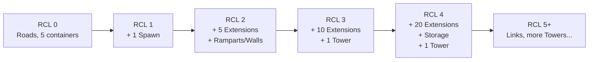
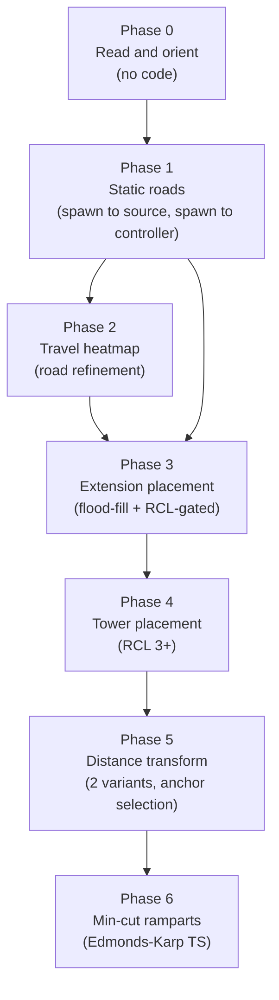

# Room Layout Automation — Learning Roadmap

**Purpose:** Phased, teach-as-you-go roadmap for automating room construction (roads, extensions, towers, defense) from RCL progression and travel patterns. Each phase is a standalone milestone you can implement across sessions.

**Maintenance:** Tick checkboxes as you complete phases. Point the agent at this file to resume work (`@docs/roadmaps/room-layout-automation.md` or “continue the room layout roadmap”).

## Progress

- [x] **Phase 0** — Read and orient (no code)
- [ ] **Phase 1** — Static roads (spawn ↔ source, spawn ↔ controller)
- [ ] **Phase 2** — Travel heatmap (road refinement)
- [ ] **Phase 3** — Extension placement (flood-fill + RCL-gated)
- [ ] **Phase 4** — Tower placement (RCL 3+)
- [ ] **Phase 5** — Distance transform (advanced, anchor selection)
- [ ] **Phase 6** — Min-cut ramparts (advanced)

---

## How to Think About the Problem

There are two orthogonal concerns. Keeping them separate in your mind (and in code) is the key:

1. **WHAT to build and WHEN** — controlled by Room Controller Level (RCL). The game enforces hard limits on how many extensions, towers, etc. you can place per level. This is a lookup table problem.

2. **WHERE to build it** — a spatial planning problem. Roads go where creeps actually walk. Extensions go somewhere open near the spawn. Towers go where they cover your base. This ranges from “hardcoded relative to spawn” (easy) to “distance transform + stamps” (advanced).

The community has settled on two broad philosophies for WHERE:

- **Prescriptive (stamps/bunkers)**: design the layout offline once, store it as a data structure, place pieces as RCL unlocks them. Predictable, cheap at runtime, less adaptive.
- **Reactive (heatmap)**: observe where creeps actually walk each tick, accumulate a heat signal, build roads on hotspots. Adaptive, but requires careful memory budgeting.

**Recommended approach for learning**: start prescriptive for everything except roads (roads benefit greatly from reactive heatmap), then layer in the heatmap once the prescriptive system is solid.

---

## The Existing Scaffold (know this before touching anything)

Key file: [`src/management/roomConstruction.ts`](../../src/management/roomConstruction.ts)

- Already runs every `CONSTRUCTION_PLAN_INTERVAL = 100` ticks
- Already guards on `Game.cpu.bucket < 1200`
- Already places containers with `PathFinder.search`

Key file: [`src/management/roomManager.ts`](../../src/management/roomManager.ts) — calls `runRoomConstruction`

Key file: [`src/types.d.ts`](../../src/types.d.ts) — `RoomMemory` is where we add layout state fields

This scaffold is your home base. Every phase in this roadmap adds to `roomConstruction.ts` or an extracted sibling file, never duplicating the interval/bucket logic.

---

## Mental Model: RCL Progression as a State Machine



`room.controller?.level` gives you the current level. The game’s `CONTROLLER_STRUCTURES` constant (built into the Screeps API) gives you the allowed count per structure type per level — you do not need to hardcode the table yourself.

**Key API fact (from [Control](http://docs.screeps.com/control.html)):** roads are available from RCL 0; extensions start at RCL 2; first tower at RCL 3.

---

## Phase 0 — Read and Orient (no code yet)

**Goal**: understand what you are working with before writing a line.

- Read [`src/management/roomConstruction.ts`](../../src/management/roomConstruction.ts) top to bottom
- Read the [official RCL table](http://docs.screeps.com/control.html) — note `CONTROLLER_STRUCTURES` is available in-game too
- Run `console.log(JSON.stringify(CONTROLLER_STRUCTURES))` in the Screeps console to see the full structure limit table at runtime
- Read [`docs/agent-references/screeps-api.md`](../agent-references/screeps-api.md) — `PathFinder.search` return shape, CPU bucket rules

**You will learn**: the existing CPU guard pattern, how `PathFinder.search` returns `{ path: RoomPosition[], incomplete: boolean }`, and why we run construction planning on an interval not every tick.

---

## Phase 1 — Static Road Placement Along Key Paths

**Goal**: place road construction sites along the computed paths spawn→source and spawn→controller.

**Why first**: roads are available at any RCL, builders already know how to build `FIND_MY_CONSTRUCTION_SITES`, and the repair role already handles `STRUCTURE_ROAD`. This is a complete, immediately-useful win with zero new memory schema.

**Core concept — PathFinder for road layout:**

```typescript
const result = PathFinder.search(
  spawn.pos,
  { pos: source.pos, range: 1 },
  {
    plainCost: 2,
    swampCost: 10,
    roomCallback(roomName) {
      const cm = new PathFinder.CostMatrix();
      // existing roads get cost 1 (preferred) — this makes roads reinforce themselves
      room.find(FIND_STRUCTURES).forEach((s) => {
        if (s.structureType === STRUCTURE_ROAD) cm.set(s.pos.x, s.pos.y, 1);
      });
      return cm;
    },
  },
);
result.path.forEach((pos) => pos.createConstructionSite(STRUCTURE_ROAD));
```

**What you will learn**: `PathFinder.CostMatrix`, the `roomCallback` pattern, why `plainCost: 2` makes roads cost-effective (roads cost 1, so the pathfinder will prefer existing roads and the newly built path will self-reinforce over time).

**Files touched**: [`src/management/roomConstruction.ts`](../../src/management/roomConstruction.ts) only.

**Human checkpoint**: review the visual in the Screeps client (use `RoomVisual` to draw the planned path before placing sites).

---

## Phase 2 — Travel Heatmap for Road Refinement

**Goal**: track where creeps actually walk each tick; accumulate a heat signal; upgrade/add roads on well-traveled tiles that do not yet have them.

**Why after Phase 1**: Phase 1 gives you planned roads on the “correct” paths. The heatmap then fills in the gaps where creeps deviate from the plan (e.g., walking around containers, detouring around construction sites).

**Core concept — serialized CostMatrix as heatmap:**

```typescript
// In RoomMemory (types.d.ts addition):
heatmap?: number[]; // PathFinder.CostMatrix.serialize() result

// Each tick (sampled, e.g., every 10 ticks):
const cm = heatmapFromMemory(room);
for (const creep of creepsInRoom) {
  cm.set(creep.pos.x, creep.pos.y, Math.min(255, cm.get(creep.pos.x, creep.pos.y) + 1));
}
saveHeatmapToMemory(room, cm);

// In runRoomConstruction: find tiles above threshold, no existing road → place site
```

**Memory budget warning**: a serialized CostMatrix is ~2500 numbers (50×50). That is roughly 10–15 KB per room. Watch `Memory` size — this is a real constraint. One mitigation: only store the top-N hotspot positions instead of the full matrix.

**What you will learn**: `CostMatrix.serialize`/`deserialize`, memory size trade-offs, sampling strategies, tick-based accumulation.

**TypeScript type used**: `number[]` (the serialized CostMatrix format) stored in `RoomMemory`.

**Human checkpoint before merge**: measure Memory size before and after; decide full matrix vs. hotspot list.

---

## Phase 3 — Extension Placement (RCL-Gated, Positional)

**Goal**: when RCL ticks up and new extensions are allowed, place them automatically in a predictable pattern near the spawn.

**Core concept — count existing + allowed, fill the gap:**

```typescript
const allowed =
  CONTROLLER_STRUCTURES[STRUCTURE_EXTENSION][room.controller.level];
const existing = room.find(FIND_MY_STRUCTURES, {
  filter: { structureType: STRUCTURE_EXTENSION },
}).length;
const sites = room.find(FIND_MY_CONSTRUCTION_SITES, {
  filter: { structureType: STRUCTURE_EXTENSION },
}).length;
const needed = allowed - existing - sites;
// place `needed` new sites in the next available positions of your pattern
```

**Placement strategy — flood fill from spawn (preferred over spiral):**

The [Screeps-Tutorials `floodFill.js`](https://github.com/Screeps-Tutorials/Screeps-Tutorials/blob/Master/basePlanningAlgorithms/floodFill.js) provides a BFS from seed positions (e.g., your spawn) that scores every open tile by its proximity to the seed, skipping terrain walls automatically. The result is a `CostMatrix` where lower values = closer to spawn. You pick the `needed` lowest-value tiles that are not already occupied by a structure or pending site.

This is more elegant than a spiral because:

- It respects terrain walls naturally
- It gives you a consistent ranked list to draw from as each RCL unlocks more extensions
- You can re-seed from multiple anchors (spawn + storage) as the base grows

**Alternative for later**: a cross/plus stamp (manually designed 2D offset array) is faster at runtime since there is no BFS, and is worth adding after flood fill is working.

**What you will learn**: BFS over a `CostMatrix`, `CONTROLLER_STRUCTURES` lookup, counting across both built structures and pending sites.

**Files touched**: [`src/management/roomConstruction.ts`](../../src/management/roomConstruction.ts), likely extracted to a sibling `src/management/construction/extensionPlanner.ts` if it grows.

---

## Phase 4 — Tower Placement (RCL 3+, Coverage-Aware)

**Goal**: place towers in positions that maximize their hit coverage over the room border and high-traffic corridors.

**Core concept**: towers deal damage based on distance (`TOWER_FALLOFF`, range 5–20 tiles). A tower at the center of your base covers everything within 20 tiles at high damage. Simple placement: find an open tile within 5–8 tiles of spawn that is not already occupied.

**Advanced approach** (later): compute a coverage score for each candidate tile by summing expected damage over wall/border tiles. Place in the tile with the best score. This is a small optimization pass, not needed to start.

**What you will learn**: `TOWER_FALLOFF`, `TOWER_OPTIMAL_RANGE`, `TOWER_FALLOFF_RANGE`, choosing between “good enough” heuristic vs. optimized placement.

---

## Phase 5 — Distance Transform for Open-Space Finding (Advanced)

**Goal**: instead of placing structures relative to spawn blindly, use the Distance Transform algorithm to score every tile by its distance from the nearest wall/obstacle, then pick the highest-scoring open cluster as your layout anchor.

**Why this matters**: every room has different terrain. A spawn in a corner room will not have a 10×10 open area near it. The Distance Transform tells you where there _is_ open space.

**Two variants from [Screeps-Tutorials `distanceTransform.js`](https://github.com/Screeps-Tutorials/Screeps-Tutorials/blob/Master/basePlanningAlgorithms/distanceTransform.js):**

Both take an `initialCM: PathFinder.CostMatrix` (where 255 = wall/obstacle) and return a scored `CostMatrix`. Tiles with high scores have lots of open space around them.

- `distanceTransform` (Chebyshev / 8-directional): considers diagonals — best for finding open **square** areas for bunker-style layouts
- `diagonalDistanceTransform` (Manhattan / 4-directional): ignores diagonals — best for finding open **diamond** areas

Both have `enableVisuals: boolean` built in — pass `true` to see the heat overlay in the Screeps client while debugging.

**Building the `initialCM` is its own step**: scan terrain with `room.getTerrain().get(x, y) === TERRAIN_MASK_WALL` and mark those tiles 255. Also mark existing structures you want to treat as obstacles.

**CPU note**: run distance transform once on room claim and cache the anchor position in `RoomMemory`. Do **not** run it every planning interval.

---

## Phase 6 — Minimum Cut Wall/Rampart Placement (Advanced)

**Goal**: automatically find the optimal tile positions for ramparts and walls that cut your base off from room exits at natural terrain chokepoints.

**Why this is powerful**: instead of manually drawing walls or guessing, the minimum cut algorithm finds the smallest set of tiles that, when walled, fully separates your base interior from every room exit — no redundant ramparts.

**Reference**: [Screeps-Tutorials `mincut.ts`](https://github.com/Screeps-Tutorials/Screeps-Tutorials/blob/Master/basePlanningAlgorithms/mincut.ts) — a full TypeScript implementation. It uses a modified Edmonds-Karp (BFS-based max-flow) algorithm.

**Signature:**

```typescript
minCutToExit(sources: Point[], costMap: CostMatrix): Point[];
// sources = your base interior tiles (e.g. tiles within N of spawn)
// costMap = CostMatrix where 255 = terrain wall, others = rampart weight/cost
// returns = array of {x,y} tile positions to place ramparts
```

**The `costMap` weights let you express preferences**: tiles you want to avoid (e.g. near sources) get high cost so the algorithm routes around them. Terrain walls are 255 (impassable).

**CPU note**: this is expensive. Run once on room claim or when you consciously replant defenses. Store the result (array of positions) in `RoomMemory`.

**What you will learn**: max-flow / min-cut graph theory (conceptually), why TypeScript `Int32Array` is faster than plain arrays for this, how `CostMatrix` doubles as both a pathfinding weight and a graph capacity structure.

**Community resources for this phase:**

- [Screeps Wiki: Automatic Base Building](https://wiki.screepspl.us/Automatic_base_building) — minimum cut section
- [Automating Base Planning in Screeps (Harabi)](https://sy-harabi.github.io/Automating-base-planning-in-screeps/) — full walkthrough including rampart step

---

## Recommended Start Order



Phase 3 only requires Phase 1 as prerequisite (you need roads to reach extensions). Phase 2 (heatmap) can run in parallel or after Phase 3 depending on your interest. Phases 5 and 6 are independent of 2–4 and can be tackled whenever you want to level up defense planning.

---

## Key References

- [`docs/agent-references/screeps-api.md`](../agent-references/screeps-api.md) — PathFinder.search, CPU bucket, action timing
- [`src/management/roomConstruction.ts`](../../src/management/roomConstruction.ts) — existing scaffold
- [`src/types.d.ts`](../../src/types.d.ts) — where new `RoomMemory` fields go
- [`src/management/AGENTS.md`](../../src/management/AGENTS.md) — split construction under `construction/` if files grow
- [Official RCL table](http://docs.screeps.com/control.html) + `CONTROLLER_STRUCTURES` in-game constant
- [Harabi’s base planning guide](https://sy-harabi.github.io/Automating-base-planning-in-screeps/) — step-by-step community walkthrough
- [Screeps Wiki: Auto base building](https://wiki.screepspl.us/Automatic_base_building) — algorithm taxonomy
- [Screeps-Tutorials/basePlanningAlgorithms](https://github.com/Screeps-Tutorials/Screeps-Tutorials/tree/Master/basePlanningAlgorithms) — canonical reference implementations:
  - `distanceTransform.js` — two variants (Chebyshev + Manhattan), visualizable, Phase 5
  - `floodFill.js` — BFS from seeds returning proximity CostMatrix, Phase 3
  - `mincut.ts` — full TypeScript Edmonds-Karp min-cut, Phase 6

---

## Delegation / Handoff to Another Agent Session

Use this section when handing a phase to a fresh agent (new chat, background task, etc.) so it has full context without replaying this conversation.

### Prompt template

Copy, fill in the bracketed fields, and paste as the opening message in a new session:

```text
Implement Phase [N] of @docs/roadmaps/room-layout-automation.md only.

Repo: screeps-ai-v03

Scope:
- [One sentence describing the phase goal — e.g. "Place road construction
  sites along PathFinder paths from each spawn to each source and to the
  room controller, inside runRoomConstruction."]
- Follow existing CONSTRUCTION_PLAN_INTERVAL and MIN_BUCKET_FOR_CONSTRUCTION_PLAN
  in src/management/roomConstruction.ts; do not duplicate that orchestration.
- Obey @src/management/AGENTS.md, root @AGENTS.md, and
  @docs/agent-references/screeps-api.md for PathFinder / createConstructionSite
  conventions.

Out of scope:
- No Phase [N+1] features ([name the next phase]).
- No drive-by refactors outside what Phase [N] touches.

Skills to follow:
- /checking-screeps-api (validate intent timing, return codes)
- /screeps-management-change (management module boundaries)
- /screeps-learning-loop (teach-as-you-go, human checkpoints)

Verify: npm run fix then npm run build (PowerShell: run separately).

When done: mark Phase [N] complete ([x]) in the Progress section of
docs/roadmaps/room-layout-automation.md.
```

### Files to @mention / attach

| Purpose                 | Paths                                      |
| ----------------------- | ------------------------------------------ |
| Spec (always)           | `@docs/roadmaps/room-layout-automation.md` |
| Implementation target   | `@src/management/roomConstruction.ts`      |
| Orchestrator            | `@src/management/roomManager.ts`           |
| Conventions             | `@src/management/AGENTS.md`, `@AGENTS.md`  |
| API safety              | `@docs/agent-references/screeps-api.md`    |
| Memory types (Phase 2+) | `@src/types.d.ts`                          |

### Why this works

- The roadmap doc is the single source of truth — goals, code sketches, checkpoints, and references are all inline.
- The prompt template sets boundaries (scope and out-of-scope) so the agent does not drift into later phases.
- Skills enforce intent-timing checks and human review points automatically.
- Verification (`npm run fix` + `npm run build`) catches lint and type errors before you review.
- The checkbox update in the Progress section keeps the roadmap current for the next session.
